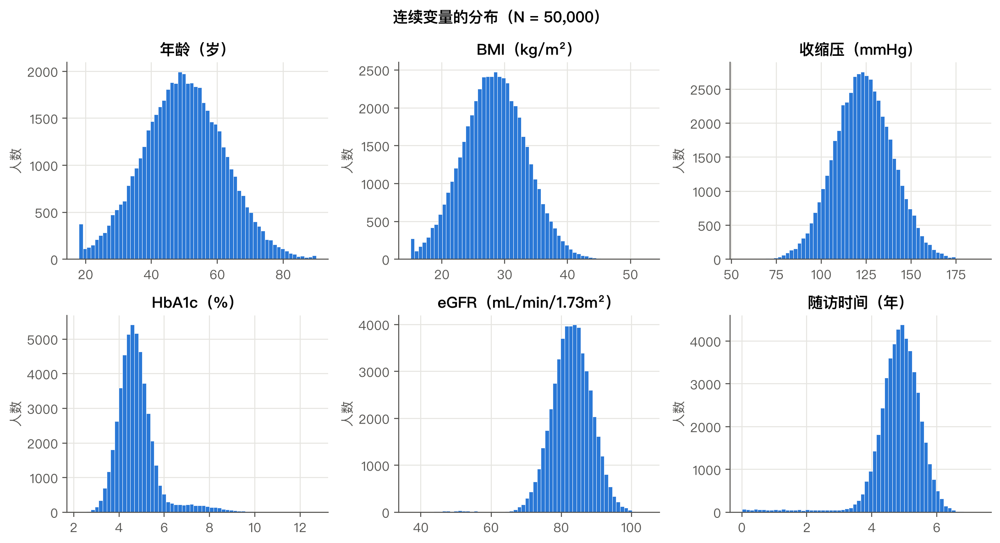
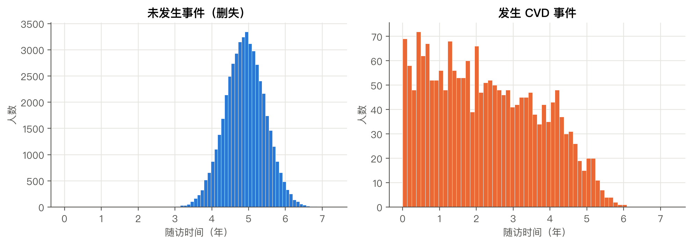
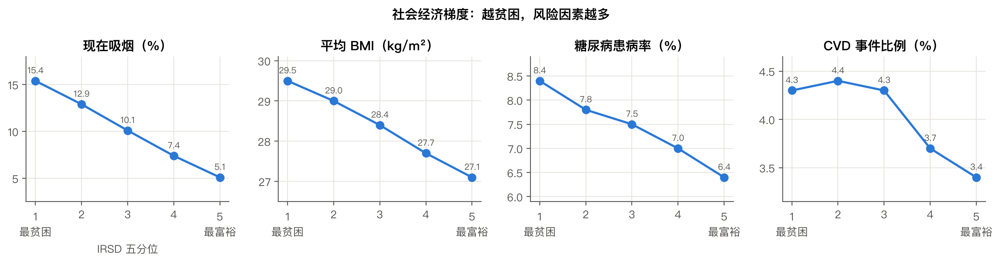
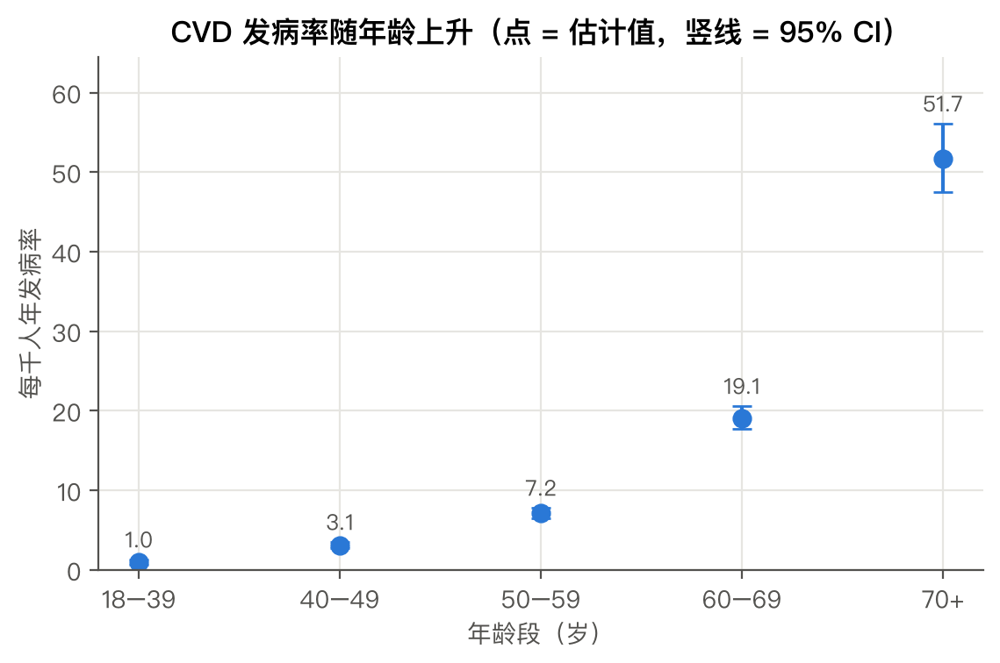
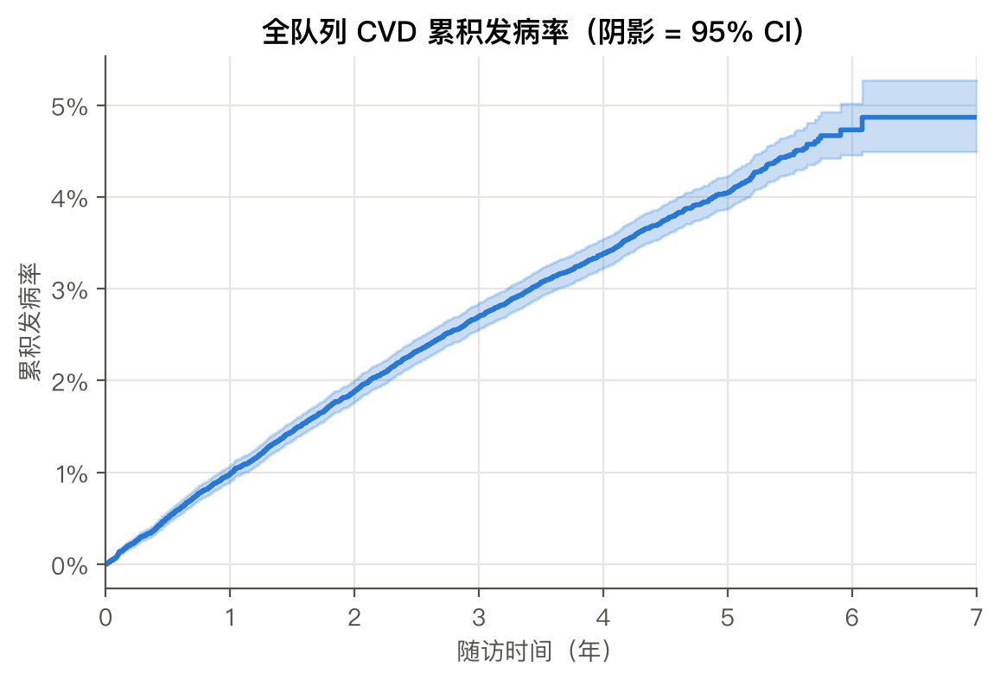
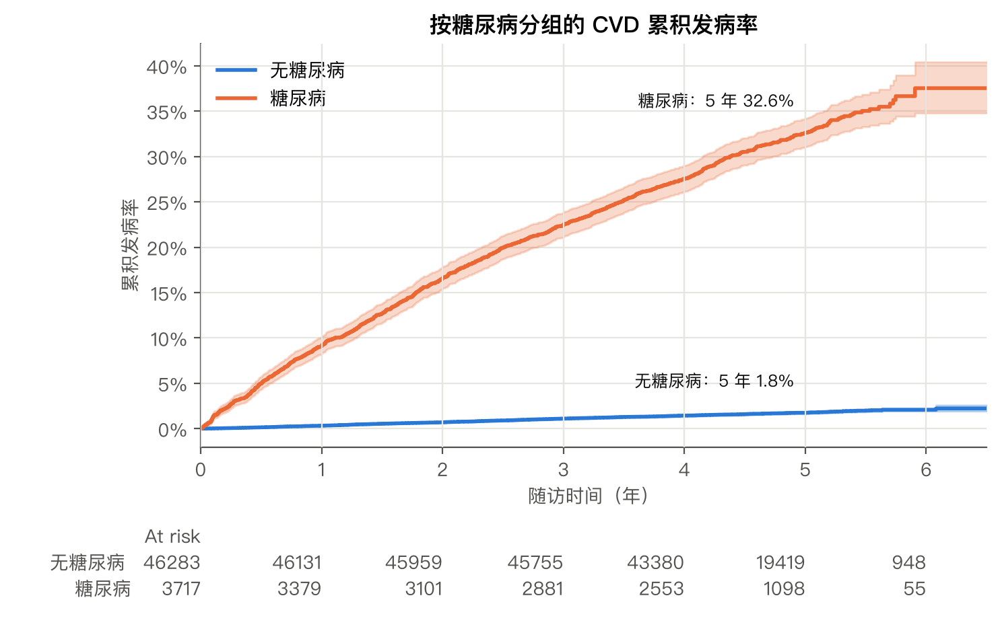
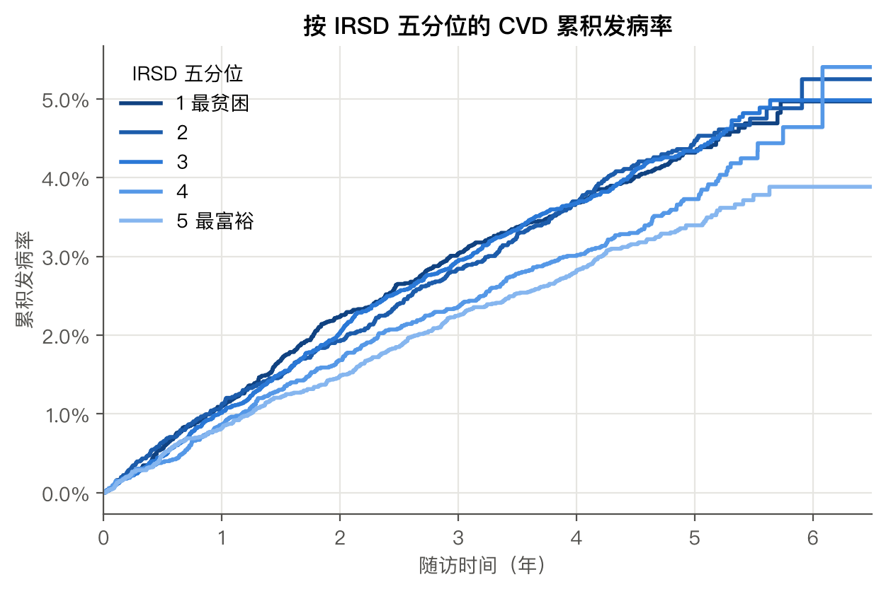
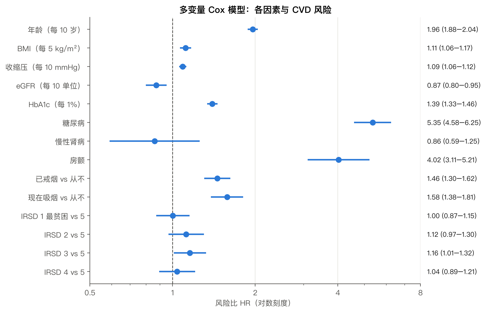
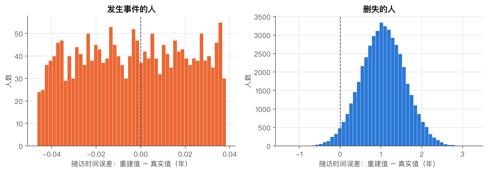

# 顶刊风格可视化学习指南

本项目的 9 张图按医学顶刊（NEJM / Lancet / JAMA / BMJ）的统计图惯例和 Nature 系的排版规范重新绘制。这份指南讲三件事：**用了哪些原则**、**每张图改了什么**、**怎么把这些原则用到你自己的图上**。

所有作图设置都在 [primecvd/pubplot.py](../primecvd/pubplot.py) 里，每一行都注明了"为什么"，建议配合本指南通读。精讲篇（w**a）的 9 张图、工程篇的图和命令行报告（`outputs/official/report.html`）里的图都使用同一套风格。

---

## 一、八条核心原则

| # | 原则 | 在本项目中的体现 |
|---|---|---|
| 1 | **按印刷尺寸作图** | 单栏 89 mm / 1.5 栏 120 mm / 双栏 183 mm；字号直接设为 6–8 pt，不靠事后缩放 |
| 2 | **颜色编码"含义"，全文统一** | 朱红 = 暴露 / 事件，蓝 = 参照 / 未发生事件，紫色深浅 = IRSD 等级，灰蓝 = 单一系列 |
| 3 | **一定展示不确定性** | 所有估计值都带 95% CI；KM 曲线带 CI 阴影和风险人数表 |
| 4 | **刻度要诚实** | 柱状图从 0 开始；点估计可以截取范围，但要说明；比值（HR）用对数轴 |
| 5 | **直接标注优于图例** | 组名直接写在曲线旁、写成曲线的颜色；只有标不下时才用图例 |
| 6 | **注释只服务于结论** | 每张图只标最关键的一两处（截断、5 年发病率、倍数差异），不在每个点上都写数字 |
| 7 | **删掉不传达数据的元素** | 去掉上、右边框和网格；参考线细、灰、虚；图内不写大标题 |
| 8 | **图注承担标题和说明** | 每张图后都有一段"图注"示范：说明图形元素、误差线含义和统计方法 |

---

## 二、配色系统

所有颜色来自 Okabe-Ito 色板或单色相渐变，**常见的色盲类型下仍可区分**，也避开了红-绿搭配（约 8% 的男性是红绿色弱）。

| 名称（`pp.` 常量） | 色值 | 含义 | 用在哪些图 |
|---|---|---|---|
| `EXPOSED` | `#D55E00` 朱红 | 暴露组、发生事件、需要注意的地方 | 图 1 截断注释、图 2、6、9 |
| `REFERENCE` | `#0072B2` 蓝 | 参照组、未发生事件 | 图 2、6、9 |
| `IRSD[1]`…`IRSD[5]` | 深紫 → 浅紫 | 有序等级：越贫困越深 | 图 3、7 |
| `NEUTRAL` | `#5b7a99` 灰蓝 | 只有一组数据时 | 图 1、4、5 |
| `INK` / `GREY` | 近黑 / 中灰 | 主要结果 / 次要信息 | 图 8：调整 HR 黑色、粗 HR 灰色 |

**要点**：颜色越少越好。一张图里醒目的颜色只留给最重要的信息；同一个概念在不同的图里始终用同一种颜色，读者看过一张图后就不用再查图例。

---

## 三、逐图对比：润色前 → 润色后

### 图 1｜基线变量分布（w01a）

| 润色前 | 润色后 |
|---|---|
|  |  |

- 尺寸从随意的 11×6 英寸改为双栏宽 183 mm，字号从 10–12 pt 降到印刷时真实可读的 6–7.5 pt
- 加了面板标号 A–F；每个子图的大标题改成**带单位的轴标题**
- 中位数（IQR）移到坐标区外面；中位数用一条细竖线标出
- 加了临床阈值参考线（高血压 140、糖尿病 6.5%、CKD 60）
- 用朱红色注释指出截断堆积，这是这张图最值得注意的发现

### 图 2｜随访时间按结局分组（w01a）

| 润色前 | 润色后 |
|---|---|
|  |  |

- 两个面板合并成**一个坐标**，两组分布可以直接比较
- 纵轴改成"占本组的百分比"：两组人数相差 24 倍，只有这样才能比较形状
- 半透明填充加阶梯轮廓线，重叠部分也清楚；各组中位数用同色虚线标出
- 直接标注组名和 n，不用图例

### 图 3｜社会经济梯度（w02a）

| 润色前 | 润色后 |
|---|---|
|  |  |

- **加了 95% 置信区间**：之前只有点，读者无法判断差异是否真实
- 颜色改为和 KM 曲线（图 7）一致的紫色深浅梯度，表示有序等级
- 每个数据点上的数值标签删掉，改为右上角一句结论（"1 组 / 5 组 = 3.0 倍"）
- 四个面板共用一个 x 轴标题

### 图 4｜年龄与发病率（w02a）

| 润色前 | 润色后 |
|---|---|
|  |  |

- 增加**对数刻度面板 B**：发病率随年龄指数增长，在对数轴上变成一条直线，"每 10 岁 × 2.7"一眼可见
- x 轴刻度标签第二行写事件数，直接说明为什么有的置信区间更宽
- 误差线去掉了"帽子"（端点横杠），更简洁

### 图 5｜全队列 KM 曲线（w05a）

| 润色前 | 润色后 |
|---|---|
|  |  |

- 加了**风险人数表**，并与曲线的时间轴严格对齐
- 截断在第 6 年：之后仍在随访的人不到 2%，曲线只是噪声
- 标出正文会引用的 1、3、5 年累积发病率
- 单栏尺寸：只有一条曲线，不需要占满双栏

### 图 6｜按糖尿病分组的 KM 曲线（w05a）

| 润色前 | 润色后 |
|---|---|
|  |  |

- lifelines 默认的英文 "At risk" 表换成自己绘制的风险人数表，组名用曲线的颜色
- **嵌入放大图**：无糖尿病组在主图里几乎是一条贴近 0 的线，嵌入图放大 y 轴后才能看清（NEJM 常见做法）
- 在第 5 年竖线处直接标注两组的 5 年累积发病率
- 截断在第 6 年，避免尾部置信区间"爆炸"

### 图 7｜按 IRSD 分组的 KM 曲线（w05a）

| 润色前 | 润色后 |
|---|---|
|  |  |

- 加了 5 行风险人数表
- P 值写在图上，而不是只打印在代码输出里
- 五组不画置信区间阴影（会糊成一片），不确定性交给森林图展示

### 图 8｜森林图（w06a）

| 润色前 | 润色后 |
|---|---|
|  |  |

- **"左表右图"**：变量、图形、HR (95% CI)、P 值在同一行对齐，这是 Lancet / JAMA 的标准版式
- **三线表**加隔行浅灰底纹；变量分组，参照组单独列出"1.00（参照）"
- **粗 HR 和调整 HR 并列**：黑色实心方块是调整 HR，灰色空心圆是粗 HR。两者的距离就是混杂调整的效果，这是全项目信息量最大的一张图
- 主次用"深浅 + 实心 / 空心"区分，不依赖彩色，黑白打印也能读
- 横轴下方标出"← 风险更低 | 风险更高 →"

### 图 9｜EMR 随访时间误差（w10a）

| 润色前 | 润色后 |
|---|---|
|  |  |

- 面板 A 的单位从"年"改成"天"：误差只有十几天，用年表示是 ±0.04 这样难读的小数
- 标出平均偏差（高估 1.05 年）和"无误差"参考线

---

## 四、给自己的图做自查：12 个问题

画完一张图，逐条过一遍：

**尺寸与文字**
1. 是按最终印刷尺寸画的吗？（单栏 89 mm / 双栏 183 mm）
2. 印刷尺寸下最小的字是否 ≥ 6 pt？全图只用一种字体吗？
3. 每个轴标题都有单位吗？

**数据表达**
4. 每个估计值都有置信区间吗？图注里写了是 CI、SD 还是 SE 吗？
5. 用长度编码的图（柱状图、面积图）从 0 开始了吗？
6. 比值（HR / OR / RR）用了对数轴吗？有 HR = 1 的参考线吗？
7. KM 曲线有风险人数表吗？随访人数太少的尾部截掉了吗？

**颜色与标注**
8. 颜色有固定含义吗？和同一篇文章里的其他图一致吗？
9. 去掉颜色（黑白打印）后还能读懂吗？
10. 能直接标注的地方，是不是还在用图例？
11. 注释是不是只点出了最关键的一两处？

**输出**
12. 导出了 PDF（矢量、字体已嵌入）和 ≥ 300 dpi 的 PNG 吗？

---

## 五、延伸阅读

- **Pocock SJ, et al.** Survival plots of time-to-event outcomes in clinical trials: good practice and pitfalls. *Lancet* 2002;359:1686–89. KM 图规范的经典文献，本项目 KM 图的"累积发病率向上画、附风险人数表、截断尾部"都来自这里
- **Morris TP, et al.** Proposals on Kaplan–Meier plots in medical research and a survey of stakeholder views. *BMJ Open* 2019;9:e030215
- **Rougier NP, et al.** Ten simple rules for better figures. *PLoS Comput Biol* 2014;10:e1003833
- **Claus O. Wilke.** *Fundamentals of Data Visualization*，免费在线阅读：https://clauswilke.com/dataviz/
- **Edward Tufte.** *The Visual Display of Quantitative Information*：数据墨水比等概念的出处
- **Nature Methods "Points of View" 专栏**（Bang Wong 等）：每期一页，讲颜色、布局、标注等单项技巧
- **Okabe M, Ito K.** Color Universal Design：本项目色板的来源
